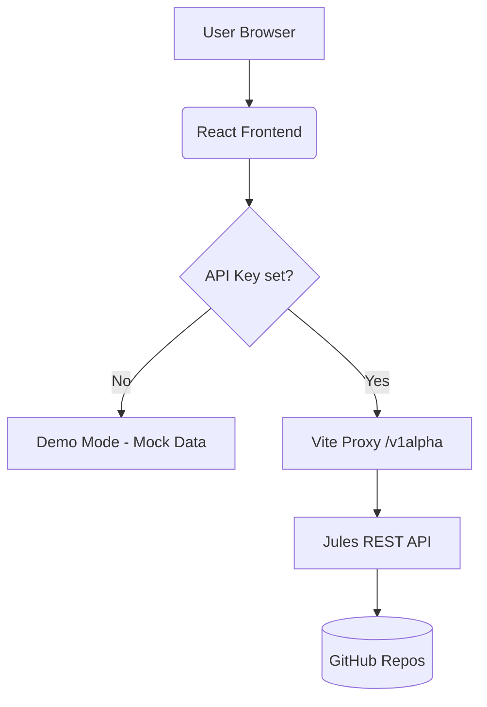

# Jules Studio

Jules Studio is a modern, unified dashboard for managing AI-driven coding sessions via the [Jules REST API](https://jules.google/docs/api/reference/overview). It provides a visual interface for delegating tasks, reviewing generated plans, monitoring real-time agent activity, and inspecting code artifacts — both as a web app and as a native VS Code extension.

## ✨ Features

### Web App
- **Session Control Center**: Create and manage AI coding tasks with granular control over prompt, source repository, branch, and `automationMode` (`AUTO_CREATE_PR` vs `MANUAL`).
- **Real-time Activity Timeline**: Monitor progress events as they happen, from plan generation to completion.
- **Interactive Review UI**: Human-in-the-loop workflows for approving agent plans and communicating with Jules through in-session messaging.
- **Artifact Inspector**: View rendered code diffs (unified patch), terminal logs (bash output), and generated media.
- **AIP-160 Filter Input**: Server-side search on session lists (press **Enter** to trigger).
- **Bulk Operations**: Multi-select sessions with "Select All" and bulk-delete with a single confirmation dialog.
- **Custom Dialogs**: Fully themed `Alert` and `ConfirmDialog` components — no more native browser popups.
- **Persistent Local Notes**: Per-session sticky notes saved to `localStorage`.
- **Desktop Notifications**: Browser Notification API alerts when sessions reach `AWAITING_PLAN_APPROVAL` or `COMPLETED`.
- **Inline Unified Diff Viewer**: Green/red syntax-highlighted patch viewer.
- **Dynamic Branch Dropdown**: "Starting Branch" auto-populates from the selected repository's branches.
- **Load More Pagination**: Infinite-scroll style pagination for sessions and repositories via `nextPageToken`.
- **API Resilience**: Exponential backoff for `429 Too Many Requests` (5s → 10s → 20s → up to 60s) and global error alerts for other failures.
- **Repository Explorer**: Browse and manage connected GitHub repositories.
- **CLI & Integrations**: Step-by-step CLI setup, authentication guides, interactive TUI preview, and dynamic per-session pull snippets.

### VS Code Extension (`vscode-extension/`)
- **Sidebar TreeView**: All sessions with state-aware icons (🚀 in-progress, ✅ completed, ⚠️ needs approval) and rich Markdown tooltips (repo, relative time, next action).
- **Multi-Panel Webview**: Open multiple session detail panels simultaneously; state is preserved when switching tabs (`retainContextWhenHidden`).
- **CodeLens Actions**: `🐙 Jules: Write Tests` and `🐙 Jules: Refactor` buttons appear inline above functions, methods, and classes.
- **Context Integration**: Toggle "Include Active File" as context when creating a session; right-click a terminal error to "Send Terminal Error to Jules".
- **Proactive Notifications**: Desktop alerts with **Approve / Apply / Open** action buttons for state transitions; batched to a single summary if 3+ sessions change at once.
- **Auto-Apply**: Optional `jules.autoApplyAfterApproval` setting to pull changes automatically on completion, followed by an auto-focus of the Source Control view.
- **Background Polling**: Configurable interval (default 60s); smart throttling — stops for `COMPLETED`/`FAILED`, slows to 30s for `PAUSED`/`QUEUED`.
- **Workspace Intelligence**: Auto-detects git remotes, matches to Jules sources, and reads the current branch for session creation.
- **Secure Storage**: API keys stored in the OS Keychain via VS Code `SecretStorage`.
- **Status Bar**: Live session count and pending approval count.
- **CLI Guard**: Detects if `@google/jules` CLI is installed before attempting pulls; shows install link if missing.

## 🚀 Getting Started

### Prerequisites

- **Node.js**: Version 18 or higher.
- **Jules API Key**: Obtain your key from the Jules web app settings.
- **Jules CLI** *(for patch apply)*:
  ```bash
  npm install -g @google/jules
  ```

### Installation

1. Clone this repository:
   ```bash
   git clone https://github.com/tazztone/jules-studio.git
   cd jules-studio
   ```
2. Install dependencies:
   ```bash
   npm install
   ```

### Local Development

Start the development server:
```bash
npm run dev
```
The app will be available at `http://localhost:5173`. Navigate to **Settings** and enter your Jules API Key to switch from Demo Mode to Live Mode.

## 🧪 Testing

Jules Studio maintains a high standard of reliability with a comprehensive automated test suite.

### Run Tests
```bash
npm test
```

### Coverage Report
```bash
npm test -- --coverage --run
```

Current overall coverage: **86.78%** across 50 tests in 7 test files.

| Component | Coverage |
|---|---|
| Core App (routing, `localStorage`) | 84.6% |
| Sessions List | 83.3% |
| Session Detail | 83.8% |
| Sources Management | 96.6% |
| Utilities / UI (Common, Sidebar, Settings) | 100% |

The suite covers:
- **Unit Tests**: API helper (`fetchJules`), `Badge`, `StateBadge`, and individual component logic.
- **Component Tests**: Pagination, search/filter, deletion, session creation, artifact rendering, plan approval, and exponential backoff polling.
- **Integration Tests**: React Router navigation and end-to-end routing across all views.

## 🔏 Configuration & Security

### API Key
Navigate to the **Settings** tab to enter your `x-goog-api-key`. It is stored in `localStorage`. If no key is provided, the app runs in **Demo Mode** with mock data.

### Vite Proxy (CORS Handling)
API requests starting with `/v1alpha` are proxied to `https://jules.googleapis.com` via the built-in Vite proxy in `vite.config.js`, avoiding CORS issues during local development.

## 🏗 Architecture

### Data Flow


**Stack:**
- **Frontend**: React 18+ (Hooks)
- **Routing**: React Router v6
- **Styling**: Tailwind CSS (dark mode, glassmorphism)
- **Icons**: Lucide React
- **Build**: Vite
- **Testing**: Vitest + React Testing Library + `@vitest/coverage-v8`

### Directory Structure
```text
jules-studio/
├── src/
│   ├── components/          # Modular UI components
│   │   ├── __tests__/       # Component unit tests
│   │   ├── Common.jsx       # StateBadge, fetchJules, Alert, ConfirmDialog
│   │   ├── SessionsList.jsx # Dashboard, creation, bulk ops
│   │   ├── SessionDetailView.jsx  # Timeline, artifacts, DiffViewer, notes
│   │   ├── SourcesView.jsx  # Repository management
│   │   ├── CliRecipesView.jsx     # CLI & integrations guide
│   │   ├── SettingsView.jsx # API key, demo mode
│   │   └── Sidebar.jsx      # Global navigation
│   ├── __tests__/           # App-level integration tests
│   ├── App.jsx              # Main entry & dynamic routing
│   ├── main.jsx             # React DOM mount
│   └── index.css            # Tailwind directives & global styles
├── vscode-extension/        # VS Code extension (TypeScript)
├── public/                  # Static assets
├── vite.config.js           # Proxy & Vitest configuration
└── package.json             # Scripts & dependencies
```

## 📦 Deployment

```bash
npm run build
```
Output is in `dist/`, ready for Vercel, Netlify, or any static host. Ensure your host redirects all paths to `index.html` to support client-side routing.

## ❓ Troubleshooting

**CORS Errors ("Failed to fetch")**
Ensure you are accessing the app via `localhost` so the Vite proxy is active. Direct file access (`file://`) will not proxy requests.

**API Key not saving**
`localStorage` must be enabled. Avoid Private/Incognito mode, or use a standard browser window.

**Search/Filter not working**
The search bar uses [AIP-160](https://google.aip.dev/160) syntax. Press **Enter** to trigger — blurring the field will not fire a search to avoid unnecessary API calls.

**Desktop notifications not appearing**
Ensure browser notifications are allowed for `localhost` in your browser settings.

---

## 👨‍💻 Contributing

1. Fork the repository.
2. Create a feature branch: `git checkout -b feat/your-feature`
3. Commit your changes: `git commit -m 'feat: add amazing feature'`
4. Push to the branch: `git push origin feat/your-feature`
5. Open a Pull Request.

---
*Created with ❤️ by the **Antigravity** team at Google DeepMind.*
