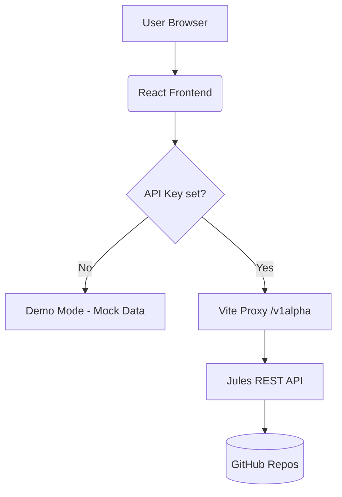

# Jules Studio

Jules Studio is a modern, unified dashboard for managing AI-driven coding sessions via the [Jules REST API](https://jules.google/docs/api/reference/overview). It provides a visual interface for delegating tasks, reviewing generated plans, monitoring real-time agent activity, and inspecting code artifacts.

## ✨ Features

- **Session Control Center**: Create and manage AI coding tasks with granular control over prompt, source repository, and branch.
- **Real-time Activity Timeline**: Monitor progress events as they happen, from plan generation to completion.
- **Interactive Review UI**: Human-in-the-loop workflows for approving agent plans and communicating with Jules through in-session messaging.
- **Artifact Inspector**: View rendered code diffs (unified patch), terminal logs (bash output), and generated media.
- **API Resilience**: Automated exponential backoff for rate-limiting (429) and robust error handling for API failures.
- **Repository Explorer**: Browse connected GitHub repositories and branches.
- **CLI Recipe Builder**: A collection of common automation patterns using the `jules` CLI.

## 🚀 Getting Started

### Prerequisites

- **Node.js**: Version 18 or higher.
- **Jules API Key**: Obtain your key from the Jules web app settings.

### Installation

1. Clone this repository to your local machine.
2. Install dependencies:
   ```bash
   npm install
   ```

### Local Development

Start the development server:
```bash
npm run dev
```
The application will be available at `http://localhost:5173`.

## 🧪 Testing

Jules Studio maintains a high standard of reliability with a comprehensive test suite.

### Run Tests
```bash
npm test
```

### Coverage Report
To generate the coverage report (current: **86.78%**):
```bash
npm test -- --coverage --run
```

The suite covers:
- **Unit Tests**: Individual components and API helpers.
- **Integration Tests**: Routing, state transitions, and `localStorage` persistence.
- **Boundary Tests**: Error states, loading spinners, and empty placeholders.

## 🔏 Configuration & Security

#### API Key
Navigate to the **Settings** tab in the application to enter your `x-goog-api-key`. For local development, this key is stored in your browser's `localStorage`. If no key is provided, the app runs in **Demo Mode** with mock data.

#### Vite Proxy (CORS Handling)
To avoid Cross-Origin Resource Sharing (CORS) issues when communicating with `https://jules.googleapis.com`, this project is configured with a built-in proxy in `vite.config.js`. API requests starting with `/v1alpha` are automatically routed to the Google API backend.

## 🏗 Architecture

### Data Flow


- **Frontend**: React 18+ (Hooks, Context-like props)
- **State Management**: React State + useEffect (Local Persistence)
- **Routing**: React Router v6
- **Styling**: Tailwind CSS (Utility-first, Glassmorphism, Dark mode)
- **Icons**: Lucide React
- **Build Tool**: Vite
- **Testing**: Vitest + React Testing Library

### Directory Structure
```text
jules-studio/
├── src/
│   ├── components/          # Modular UI components
│   │   ├── __tests__/       # Component unit tests
│   │   ├── Common.jsx       # StateBadge, fetchJules, Shared UI
│   │   ├── SessionDetail/   # Timeline, Artifacts, DiffViewer
│   │   └── ...
│   ├── __tests__/           # Routing & App integration tests
│   ├── App.jsx              # Main entry & dynamic routing
│   ├── main.jsx             # React DOM mount
│   └── index.css            # Tailwind directives & global glass styles
├── public/                 # Static assets
├── vite.config.js          # Proxy & build configuration
└── package.json            # Scripts & dependencies
```

## 📦 Deployment

### Production Build
To create a production-optimized bundle:
```bash
npm run build
```
The output will be in the `dist/` directory, ready to be hosted on Vercel, Netlify, or any static hosting service.

### Deployment Tip
When deploying, ensure your hosting provider handles client-side routing (redirecting all paths to `index.html`) to support React Router.

## ❓ Troubleshooting

### CORS Errors
If you see "Failed to fetch" in the console while using a real API key:
- **Cause**: The browser is blocking the request because it bypasses the proxy.
- **Fix**: Ensure `vite.config.js` is running and you are accessing the app via `localhost` (the proxy targets `/v1alpha`).

### API Key not saving
- **Cause**: Private/Incognito mode or disabled localStorage.
- **Fix**: Enable local storage or use a standard browser window. The app requires `localStorage` to persist your key between refreshes.

### Search/Filter not working
- **Fix**: The search bar follows [AIP-160](https://google.aip.dev/160) syntax. Press **Enter** to trigger the search; clicking out of the box will not automatically refresh the list to avoid unnecessary API calls.

---

## 👨‍💻 Contributing

1. Fork the repository.
2. Create a feature branch: `git checkout -b feat/your-feature`.
3. Commit your changes: `git commit -m 'feat: add amazing feature'`.
4. Push to the branch: `git push origin feat/your-feature`.
5. Open a Pull Request.

---
*Created with ❤️ by the **Antigravity** team at Google DeepMind.*
